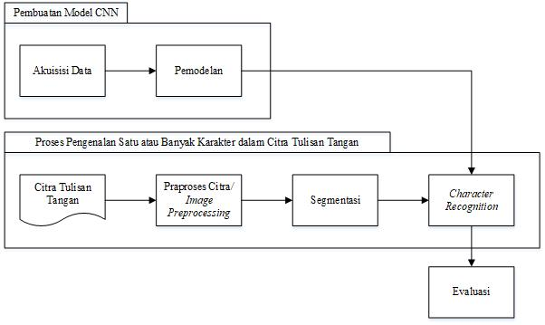

# Implementasi CNN (Convolutional Neural Network) untuk Pengenalan Citra Karakter Tulisan Tangan dalam Aplikasi Calistung 
Capstone Project merupakan proyek final yang ditujukan kepada semua peserta program Bangkit 2022 untuk dapat mengimplementasikan pengetahuannya selama pembelajaran kedalam permasalahan dunia nyata. Output dari proyek ini diharapkan dapat memberikan manfaat bagi masyarakat dan digunakan secara optimal

Calistung: Baca, Tulis, Hitung is an application that provide educational features to help children learn to write, read, and count.

## Latar Belakang
Dalam capstone project Bangkit, penulis bersama tim mengembangkan aplikasi yang diharapkan mampu mendukung kegiatan belajar baca, tulis, dan hitung. Tema pendidikan ini dipilih oleh tim dan penulis karena aspek pendidikan dianggap memiliki peranan paling penting dalam menentukan kualitas manusia, karena melalui pendidikan, manusia dianggap akan memperoleh pengetahuan, dan dengan pengetahuannya manusia diharapkan dapat membangun keberadaan hidupnya dengan lebih baik (Purwanto, 2006). Pemahaman yang baik terhadap kemampuan calistung perlu dipastikan sebab kemampuan ini mendorong pemahaman terhadap pengetahuan baru yang lebih lanjut. Hal ini turut didukung oleh survei yang menunjukkan bahwa 60% orang tua menganggap Calistung penting untuk anak usia 5-6 tahun (Dian Pertiwi et al., 2021). 

Sebagi peserta dari jalur pembelajaran Machine Learning, penulis memiliki andil dalam membuat model Machine Learning. Pembuatan model ini meliputi kegiatan mencari dan mengolah dataset untuk rekognisi citra karakter tulisan tangan, membuat model CNN menggunakan Tensorflow dan Keras, serta membuat kode image preprocessing dan segmentation menggunakan Python OpenCV2 agar aplikasi dapat mendeteksi serangkaian karakter pada citra yang berisi kata.  Bersama dengan tahap praproses yang telah dirancang, model yang dibuat oleh penulis nantinya dapat merekognisi teks yang digoreskan oleh pengguna pada layar aplikasi. 

## Metodologi
Agar tujuan pembuatan dan pengimplementasian model rekognisi karakter citra tulisan tangan dapat tercapai, tahapan perancangan model dan implementasinya dijelaskan pada Gambar 3.2 (Mustafa et al., 2022).



Dataset yang digunakan dalam pembuatan model rekognisi citra karakter tulisan tangan ini ialah Dataset MNIST (National Institute of Standards and Technology, 2020) dan dataset Kaggle Alphabet (Patel, 2018). Dataset MNIST terdiri atas 10 kelas (angka 0-9) dengan jumlah data sebesar 60.000. Tiap digit memiliki ukuran yang seragam, yaitu 28x28 pixel (Saqib et al., 2022). Dataset Kaggle Alphabet yang turut digunakan terdiri dari 26 kelas (huruf kapital A-Z) dengan jumlah data lebih dari 297.000 set. 

Kedua dataset yang berwarna greyscale tersebut kemudian digabungkan, sehingga akan dihasilkan satu dataset yang terdiri atas 36 kelas dengan rincian 10 kelas yang mewakili angka 0-9 dan 26 kelas yang mewakili huruf kapital A-Z. Total data pada dataset gabungan Kaggle Alphabet dengan MNIST ini ialah sebanyak 442.450 data. 


Untuk menangani distribusi data yang tidak seragam, penulis menerapkan cost-sensitive learning, di mana model Machine Learning memperhitungkan biaya kesalahan prediksi (dan kemungkinan biaya lainnya) saat melatih model. Pada model deep learning, cara paling sederhana untuk menerapkannya adalah dengan menggunakan pembobotan yang diterapkan melalui parameter class_weight pada fungsi pelatihan fit (Brownlee, 2020). 

Implementasi metode Convolutional Neural Network untuk mendeteksi karakter tulisan tangan telah banyak dilakukan dengan hasil evaluasi yang baik. Implementasi model CNN untuk pengenalan karakter pada penelitian Mustafa et al. (2022) menunjukkan nilai akurasi 89%. Selain itu, penelitian Harjoseputro (2018) yang mengimplementasikan CNN untuk pengklasifikasian aksara Jawa menunjukkan nilai akurasi sebesar 85%. Tidak hanya itu, penerapan CNN pada penelitian Lamanauw (2017) untuk mengenali kata tulisan huruf Korea menunjukkan nilai akurasi 86,9%. Dengan mempertimbangkan performa CNN yang baik dalam mengenali karakter tulisan tangan, serta adanya kemungkinan pengimplementasian CNN menggunakan TensorFlow, maka pada penelitian ini penulis membuat model pengenalan karakter tulisan tangan menggunakan metode Convolutional Neural Network.

## Hasil dan Pembahasan
Pemilihan model didasari pada kriteria good fit, di mana pada kurva pembelajaran terlihat nilai training loss menurun hingga sampai ke posisi stabil, begiti juga dengan nilai validation loss yang memiliki jarak yang kecil dengan nilai training loss (Brownlee, 2018). Berdasarkan hasil percobaan, model yang dipilih adalah model usulan 2 dengan padding 2, learning rate 1e-4 karena model tersebut memenuhi kriteria good fit serta nilai akurasi yang baik. Model ini memiliki nilai training loss menurun pada satu titik hingga akhirnya stabil. Pada validation loss, nilainya memiliki jarak yang kecil dengan kurva training loss di akhir epoch.


Akurasi :   96.84%
Loss    :   0.1169

Evaluasi terhadap model juga dapat dilihat melalui confusion matrix, seperti yang terlihat pada Gambar 4.20. Pada matriks tersebut, terlihat tren prediksi pada diagonal utama. Elemen-elemen yang berada pada diagonal utama mewakili data yang diprediksi dengan benar: label data yang sebenarnya ekivalen dengan label data hasil prediksi. Akan tetapi, terdapat beberapa kelas di mana terjadi kesalahan prediksi, seperti angka 0 yang diprediksi sebagai huruf O dan sebaliknya, angka 5 yang diprediksi sebagai huruf S dan sebaliknya, serta huruf D yang diprediksi sebagai huruf O. Di samping itu, laporan terhadap hasil evaluasi ini dapat dilihat pada Tabel yang memaparkan nilai akurasi, presisi, dan recall, di mana laporan ini dibuat berdasarkan fungsi classification report milik pustaka scikit-learn terhadap data validasi. Pada data validasi, tampak angka 0 memiliki nilai evaluasi yang buruk karena kerap diprediksi secara salah, seperti yang tergambar pada confusion matrix.


Tabel Laporan metriks evaluasi model CNN

|      label          |     precision    |     recall    |     f1-score    |     support    |
|---------------------|------------------|---------------|-----------------|----------------|
|     0               |     0.43         |     0.69      |     0.53        |     1486       |
|     1               |     0.98         |     0.97      |     0.97        |     1653       |
|     2               |     0.96         |     0.96      |     0.96        |     1474       |
|     3               |     0.99         |     0.99      |     0.99        |     1498       |
|     4               |     0.98         |     0.94      |     0.96        |     1432       |
|     5               |     0.96         |     0.87      |     0.91        |     1416       |
|     6               |     0.99         |     0.97      |     0.98        |     1443       |
|     7               |     0.99         |     0.98      |     0.99        |     1591       |
|     8               |     0.99         |     0.98      |     0.99        |     1515       |
|     9               |     0.99         |     0.98      |     0.99        |     1469       |
|     A               |     1.00         |     1.00      |     1.00        |     2829       |
|     B               |     0.99         |     0.99      |     0.99        |     1803       |
|     C               |     0.99         |     0.99      |     0.99        |     4742       |
|     D               |     0.96         |     0.99      |     0.97        |     2152       |
|     E               |     0.99         |     1.00      |     1.00        |     2351       |
|     F               |     1.00         |     0.98      |     0.99        |     288        |
|     G               |     0.98         |     0.98      |     0.98        |     1212       |
|     H               |     0.99         |     0.99      |     0.99        |     1511       |
|     I               |     0.99         |     0.99      |     0.99        |     318        |
|     J               |     0.99         |     0.98      |     0.98        |     1759       |
|     K               |     0.99         |     0.98      |     0.98        |     1187       |
|     L               |     0.98         |     0.99      |     0.99        |     2381       |
|     M               |     1.00         |     1.00      |     1.00        |     2552       |
|     N               |     0.99         |     1.00      |     0.99        |     3880       |
|     O               |     0.96         |     0.88      |     0.92        |     11676      |
|     P               |     1.00         |     1.00      |     1.00        |     3924       |
|     Q               |     0.97         |     0.99      |     0.98        |     1225       |
|     R               |     1.00         |     0.99      |     1.00        |     2387       |
|     S               |     0.98         |     0.99      |     0.99        |     9751       |
|     T               |     1.00         |     0.99      |     1.00        |     4576       |
|     U               |     0.99         |     0.99      |     0.99        |     5867       |
|     V               |     0.96         |     1.00      |     0.98        |     907        |
|     W               |     1.00         |     0.99      |     0.99        |     2224       |
|     X               |     0.99         |     1.00      |     0.99        |     1311       |
|     Y               |     0.98         |     0.98      |     0.98        |     2236       |
|     Z               |     0.97         |     0.96      |     0.97        |     1301       |
|     accuracy        |                  |               |     0.97        |     91327      |
|     macro avg       |     0.97         |     0.97      |     0.97        |     91327      |
|     weighted avg    |     0.97         |     0.97      |     0.97        |     91327      |

Implementasi model dalam aplikasi dapat dilihat pada repository [berikut](https://github.com/Chino-ai/Calistung)

## Kesimpulan
Penulis mengimplementasikan kemampuan yang telah dipelajari selama program Bangkit pada proyek akhir melalui pengembangan model Convolutional Neural Network untuk mendeteksi citra karakter tulisan tangan. Karakter tulisan tangan ini menjadi input/masukan dalam aplikasi Calistung yang dikembangkan tim Capstone Project penulis yang bertujuan untuk mendukung proses pembelajaran baca, tulis, dan hitung. Model yang dapat mendeteksi karakter tulisan tangan ini memiliki nilai akurasi 96.85%.

## Appendix
- Cara menjalankan FastAPI
  
  ```bash
  uvicorn main:app
  ```
  di mana main adalah nama file pythonnya, dan app adalah nama variabel instansiasi kelas FastAPI-nya. Untuk mengakses dokumentasinya, bisa langsung mengakses `pranala/docs`